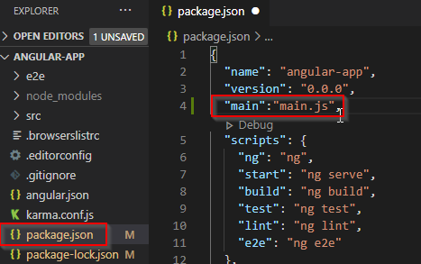
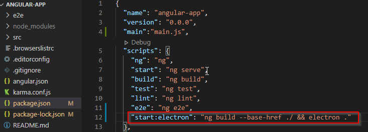
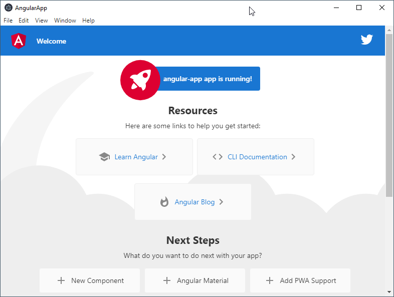
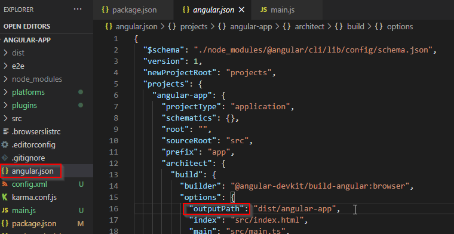
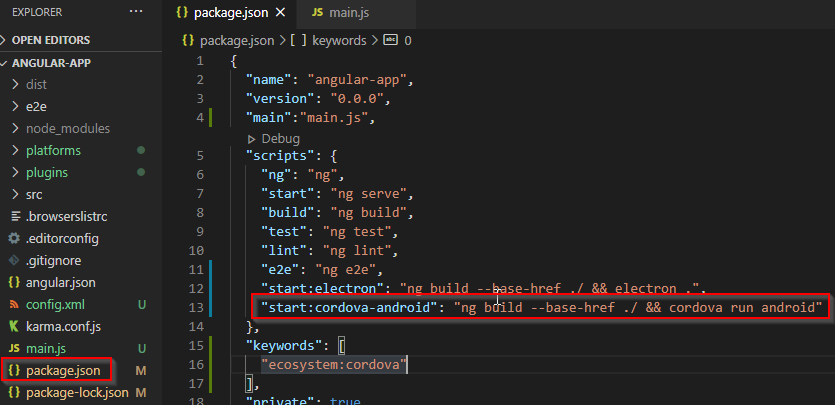
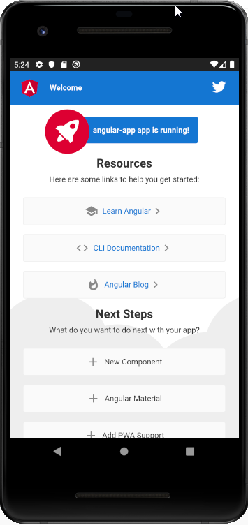

# Add Cordova and Electron to an Angular App
>Run your angular app as a web, Windows, Android and Linux app app and if you have the means, in an Iphone or a Mac. Here I'm just covering the browser, Windows and Android. You can find this code in [Github](https://github.com/atorres16/Angular_Cordova_Electron).

## Works in

* Windows 10
* [Node js 12.13](https://nodejs.org/en/)
* [Angular CLI 10.1.1](https://cli.angular.io/)
* [Cordova 10](https://cordova.apache.org/)
* [Android Studio](https://developer.android.com/studio)

 
 ## Create the Angular App
 1. Create an Angular app by running this command in the terminal
    ```
    ng new angular-app
    ```
 ### Run in the browser
 2. Run
    ```
    ng serve
    ```
 3. Open http://localhost:4200 in your favorite browser
 ## Install Electron in the Angular App
 4. To install electron in ***angular-app*** run
    ```
    npm install --save-dev electron
    ```
5. Inside ***angular-app*** create a file and name it ***main.js***
6. Copy the code the from the [first app tutorial in the Electron web site](https://www.electronjs.org/docs/tutorial/first-app#installing-electron) and paste it in ***main.js*** 
    ```javascript
    const { app, BrowserWindow } = require('electron')

    function createWindow () {
    // Create the browser window.
    const win = new BrowserWindow({
        width: 800,
        height: 600,
        webPreferences: {
        nodeIntegration: true
        }
    })

    // and load the index.html of the app.
    win.loadFile('index.html')
    }

    app.whenReady().then(createWindow)
    ```
7. Change this line
    ```js
    win.loadFile('index.html')
    ```
    to
    ```js
    win.loadFile('dist/angular-app/index.html')
    ```
8. Open ***package.json*** and add a key to set the main.js file as the ***main*** entry point
    ```json
    "main":"main.js"
    ```
    
9. Add a script field to build the angular app and run it in Electron
    ```json
    "start:electron": "ng build --base-href ./ && electron ."
    ```
    
10. Build and run the app in Windows
    ```
    npm run start:electron
    ```
    
## Integrate Cordova
I couldn't install Cordova directly in our ***angular-app***, so I stole the files from a Cordova app created in a separate folder.

11. In a separate folder run
    ```
    cordova create cordova-temp-app
    ```
12. Copy all the content from ***cordova-temp-app*** to ***angular-app**, except
***package.json***
13. Merge the json content from ***package.json*** in ***cordova-temp-app*** into ***package.json*** in ***angular-app***, my final package.json looks like this
    ```json
    {
    "name": "angular-app",
    "version": "0.0.0",
    "main":"main.js",
    "scripts": {
        "ng": "ng",
        "start": "ng serve",
        "build": "ng build",
        "test": "ng test",
        "lint": "ng lint",
        "e2e": "ng e2e",
        "start:electron": "ng build --base-href ./ && electron ."
    },
    "keywords": [
        "ecosystem:cordova"
    ],
    "private": true,
    "dependencies": {
        "@angular/animations": "~10.1.1",
        "@angular/common": "~10.1.1",
        "@angular/compiler": "~10.1.1",
        "@angular/core": "~10.1.1",
        "@angular/forms": "~10.1.1",
        "@angular/platform-browser": "~10.1.1",
        "@angular/platform-browser-dynamic": "~10.1.1",
        "@angular/router": "~10.1.1",
        "rxjs": "~6.6.0",
        "tslib": "^2.0.0",
        "zone.js": "~0.10.2"
    },
    "devDependencies": {
        "@angular-devkit/build-angular": "~0.1001.1",
        "@angular/cli": "~10.1.1",
        "@angular/compiler-cli": "~10.1.1",
        "@types/jasmine": "~3.5.0",
        "@types/jasminewd2": "~2.0.3",
        "@types/node": "^12.11.1",
        "codelyzer": "^6.0.0",
        "electron": "^10.1.1",
        "jasmine-core": "~3.6.0",
        "jasmine-spec-reporter": "~5.0.0",
        "karma": "~5.0.0",
        "karma-chrome-launcher": "~3.1.0",
        "karma-coverage-istanbul-reporter": "~3.0.2",
        "karma-jasmine": "~4.0.0",
        "karma-jasmine-html-reporter": "^1.5.0",
        "protractor": "~7.0.0",
        "ts-node": "~8.3.0",
        "tslint": "~6.1.0",
        "typescript": "~4.0.2",
        "cordova-android": "^9.0.0",
        "cordova-plugin-whitelist": "^1.3.4"
    },
    "cordova": {
        "plugins": {
        "cordova-plugin-whitelist": {}
        },
        "platforms": [
        "android"
        ]
    }
    }
    ```
14. For Cordova, we'll need to build the project in the ***www*** folder, so open ***Angular.json*** and locate the ***output-path*** field

 Change it from
    ```json
    "outputPath": "dist/angular-app",
    ```    
    to
    ```json
    "outputPath": "www",
    ```
15. Add an Android platform by running
    ```
    cordova platform add android
    ```
16. Add another start script in package.json
    ```json
    "start:cordova-android": "ng build --base-href ./ && cordova run android"
    ```
    

### Run in Android
17. Open Android Studio, and start a Virtual Device
18. Run the app in the Android emulator
```
npm run start:cordova-android
```


If you're cloning the repository, remove and re-add the cordova platform to reinstall any missing dependency
```
cordova platform remove android
cordova platform add android
```

## Problems
If you get errors, you'll have some fun updating the Java and Android SDK, you'll need to check you have the required version of Android API level installed, you'll need to have the environment variables pointing to the right places. [PLEASE READ THE CORDOVA PLATFORM GUIDE FOR ANDROID](https://cordova.apache.org/docs/en/latest/guide/platforms/android/index.html), it contains all you need to know.

## Resources
* [Electron first app](https://www.electronjs.org/docs/tutorial/first-app#installing-electron)
* [Cordova get started fast](https://cordova.apache.org/)
* [Android SDK Not installed](https://stackoverflow.com/a/27724321/3596441])
* [Gradle not installed](https://stackoverflow.com/a/45070795/3596441)
* [Build a desktop application with Electron and Angular](https://www.sitepoint.com/build-a-desktop-application-with-electron-and-angular/)
* [How to build an android app with angular](https://upgradetoangular.com/angular-mobile-app/how-to-build-an-android-app-with-angular/)


